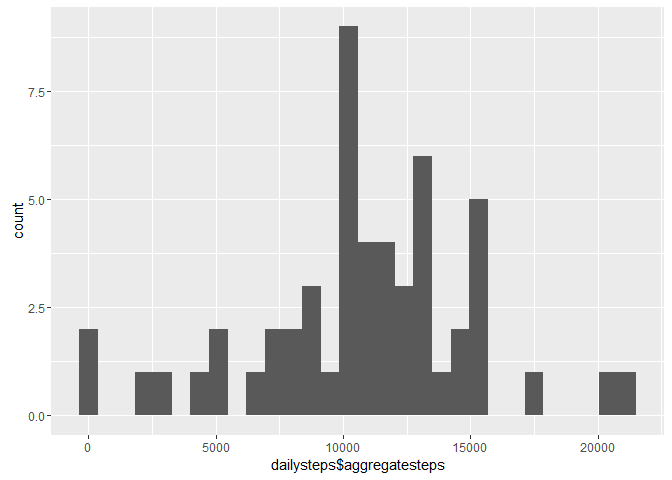
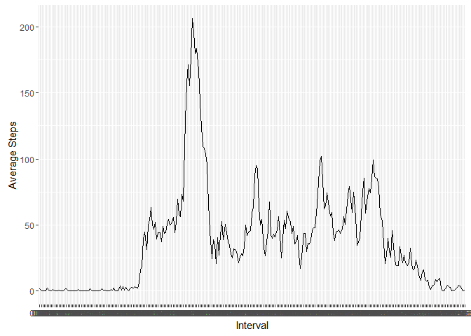
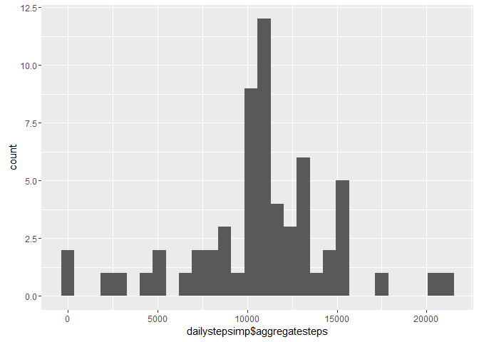
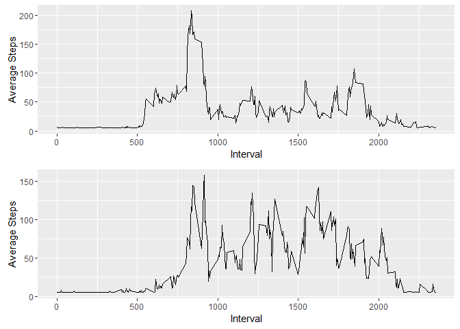

## Loading and preprocessing the data

```r
library(knitr)
library(ggplot2)
library(plyr)
library(Hmisc)
library(gridBase)
library(gridExtra)

activity <- read.csv("~/activity.csv")
dailysteps <- aggregate(activity$steps,list(activity$date),sum)
dailysteps <- rename(dailysteps,c("Group.1"="date"))
dailysteps <- rename(dailysteps,c("x"="aggregatesteps"))
```

## What is mean total number of steps taken per day?

```r
mediandailysteps <- median(dailysteps$aggregatesteps, na.rm=TRUE)
meandailysteps <- mean(dailysteps$aggregatesteps, na.rm=TRUE)
dailyhist <- qplot(dailysteps$aggregatesteps, geom="histogram") 
print(dailyhist)
```

<!-- -->
The  median is 10765. The mean is 1.0766189\times 10^{4}.

## What is the average daily activity pattern?

```r
intervalsteps <- aggregate(activity$steps,list(activity$interval),mean,na.rm = TRUE)
intervalsteps <- rename(intervalsteps,c("Group.1"="interval"))
intervalsteps <- rename(intervalsteps,c("x"="meansteps"))
intervalstrings <- sprintf("%04d",intervalsteps$interval)
intervalsteps <- cbind(intervalsteps, intervalstrings)
intervalplot <- ggplot(intervalsteps,aes(intervalstrings,meansteps, group=1))+geom_line()+xlab("Interval")+ylab("Average Steps")
print(intervalplot)
```

<!-- -->

```r
maxinterval <- intervalsteps[which.max(intervalsteps$meansteps),1]
```
The most active interval is 835.

## Imputing missing values

```r
missvalues <- sum(is.na(activity$steps))
```
There are 'r missvalues' missing values. These will be replaced by the mean steps.

```r
activityimp <- activity
activityimp$steps <- with(activity, impute(steps, mean))
dailystepsimp <- aggregate(activityimp$steps,list(activityimp$date),sum)
dailystepsimp <- rename(dailystepsimp,c("Group.1"="date"))
dailystepsimp <- rename(dailystepsimp,c("x"="aggregatesteps"))
mediandailystepsimp <- median(dailystepsimp$aggregatesteps, na.rm=TRUE)
meandailystepsimp <- mean(dailystepsimp$aggregatesteps, na.rm=TRUE)
```
The new median is 1.0766189\times 10^{4}. The new mean is 1.0766189\times 10^{4}.

```r
dailyhistimp <- qplot(dailystepsimp$aggregatesteps, geom="histogram")
print(dailyhistimp)
```

<!-- -->

## Are there differences in activity patterns between weekdays and weekends?

```r
activityimpday <- weekdays(as.Date(activityimp$date),FALSE)
activityimp <- cbind(activityimp,activityimpday)
weekdayactivity <- subset(activityimp, activityimpday != "Sunday" & activityimpday != "Saturday")
weekenactivity <- subset(activityimp, activityimpday == "Sunday" | activityimpday == "Saturday")

wdsteps <- aggregate(weekdayactivity$steps,list(weekdayactivity$interval),mean)
wdsteps <- rename(wdsteps,c("Group.1"="interval"))
wdsteps <- rename(wdsteps,c("x"="aggregatesteps"))


westeps <- aggregate(weekenactivity$steps,list(weekenactivity$interval),mean)
westeps <- rename(westeps,c("Group.1"="interval"))
westeps <- rename(westeps,c("x"="aggregatesteps"))

dayplot <- ggplot(wdsteps, aes(interval,aggregatesteps))+geom_line()+xlab("Interval")+ylab("Average Steps")
endplot <- ggplot(westeps, aes(interval,aggregatesteps))+geom_line()+xlab("Interval")+ylab("Average Steps")
grid.arrange(dayplot,endplot)
```

<!-- -->
